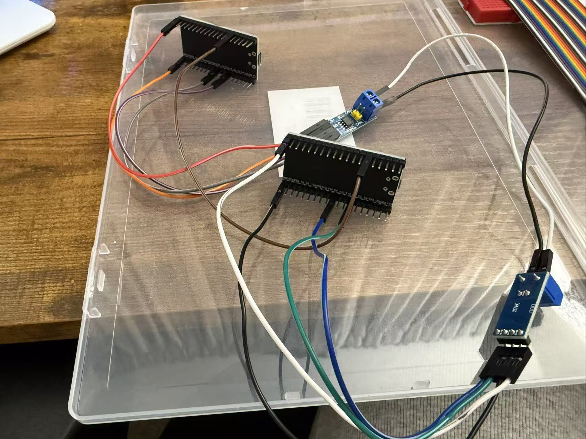
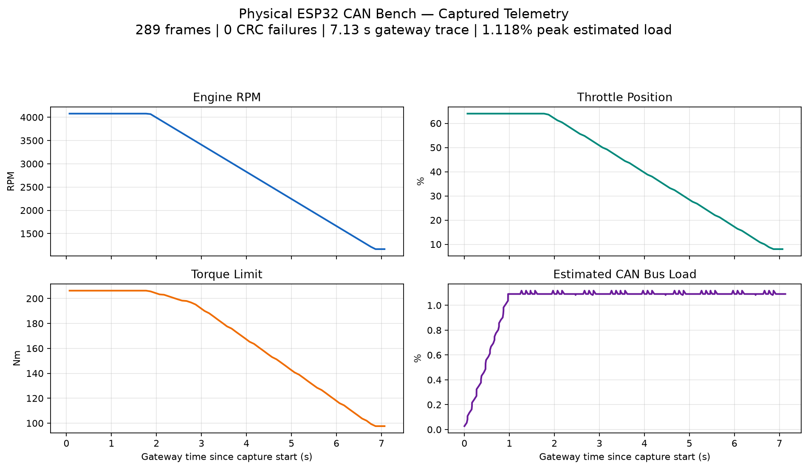
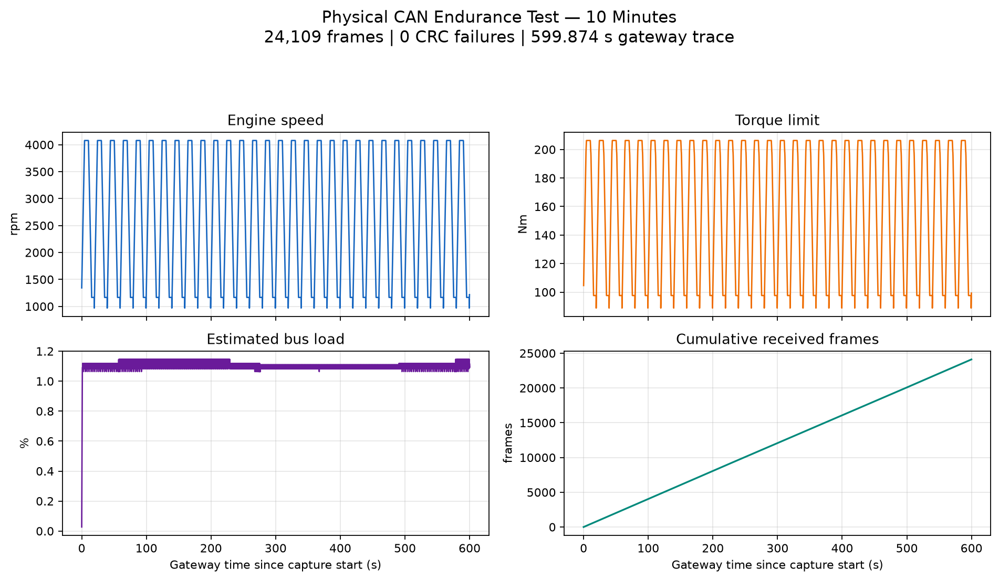
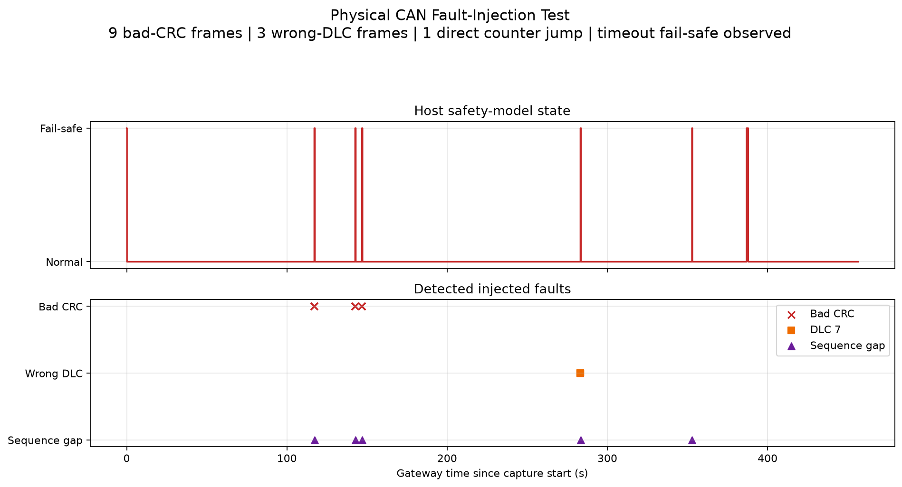

# CAN Bus ECU Simulator and Data Logger

[](https://github.com/Shanshan3133/can-ecu-simulator/actions/workflows/ci.yml)


A portfolio-ready automotive CAN 2.0A network built with two low-cost ESP32 development boards and two 3.3 V CAN transceivers. The project demonstrates embedded firmware, message and signal design, safety-oriented communication monitoring, data logging, protocol decoding, automated validation, and real-time visualization. A vendor-neutral FPGA extension now develops the protocol controller itself in RTL, beginning with verified CRC-15/CAN and nominal bit-timing primitives.

## Physical hardware evidence

The two-node network has been assembled and verified on a physical ESP32/SN65HVD230 bench. A completed ten-minute capture contains **24,109 real CAN frames**, all five designed identifiers, and **zero CRC failures**. Separate physical fault injection verifies bad-CRC and wrong-DLC rejection, rolling-counter loss detection, timeout fail-safe behavior, the 60 Nm safe command, and automatic recovery.









See [Physical Hardware Results](docs/HARDWARE_RESULTS.md) for the measured frame counts, timing results, original CSV, and the scope of the completed validation.

The network operates at **500 kbit/s** with standard 11-bit identifiers:

- **Node A — Engine ECU:** simulates a repeatable drive cycle and broadcasts RPM, throttle position, coolant temperature, a rolling counter, and CRC every 100 ms.
- **Node B — Torque/Logger ECU:** validates Engine Status frames, calculates torque limits, applies a deterministic fail-safe policy, publishes dashboard data, and bridges relevant bus traffic to the host over USB serial. Optional microSD logging is included.
- **Host Telemetry ECU:** decodes traffic from a custom DBC-style database, records CSV data, estimates bus utilization, mirrors the safety-state logic, and plots time-series signals and a live RPM–torque map.

The dashboard is implemented as a third **logical ECU** on Node B, so the baseline system requires only two boards. Its 50 ms message creates a useful mix of CAN priorities and transmission periods. The same logic can later be moved to a third physical ESP32 without changing the protocol.

## Engineering highlights

- Classical CAN 2.0A, 11-bit identifiers, 500 kbit/s
- ESP32 native TWAI controller with external SN65HVD230 transceivers
- Explicit Intel/little-endian signal encoding
- CRC-8/SAE-J1850 protection for application messages
- Four-bit rolling counters and sequence-loss detection
- Fail-safe torque limited to 60 Nm after three consecutive faults or a 300 ms timeout
- Three consecutive valid frames required to leave fail-safe mode
- Multi-rate traffic at 50 ms, 100 ms, and 1000 ms
- CAN priority demonstration using IDs 0x100, 0x101, 0x200, 0x701, and 0x702
- Built-in bad-CRC, wrong-DLC, rolling-counter, and timeout fault injection
- Bus-off recovery polling and truthful TX logging only after successful CAN transmission
- CSV logging of raw frames, decoded signals, CRC status, bus load, and safety state
- Separate live counters for bad CRC, wrong DLC, and rolling-counter gaps
- Live RPM, throttle, torque-limit, and RPM–torque-map visualization
- Hardware-free traffic simulation and 13 automated host-side tests
- Physical two-node CAN communication verified with a retained decoded trace
- GitHub Actions automatically tests the host tool, exercises simulation and evidence plotting, and compiles all three firmware environments
- Vendor-neutral Verilog CRC-15/CAN and nominal bit-timing modules with self-checking RTL simulation

## Repository layout

```text
config/vehicle.dbc.json          Custom DBC-style bus and signal database
firmware/platformio.ini          PlatformIO environments for both ESP32 nodes
firmware/src/common/             Shared CAN driver and protocol utilities
firmware/src/engine_ecu/         Engine ECU firmware and fault injection
firmware/src/torque_logger_ecu/  Torque, safety, gateway, dashboard, and SD logic
host/can_ecu_tool/               Python decoder, logger, simulator, and plots
host/tests/                      Protocol, safety, and bus-load tests
fpga/rtl/                        Vendor-neutral CAN controller RTL
fpga/sim/                        Self-checking Verilog testbenches
fpga/tests/run_rtl_tests.py      Cross-platform Icarus test runner
docs/network_topology.svg        Network architecture diagram
docs/WIRING.md                   Wiring and power-up instructions
docs/PROTOCOL.md                 Message layout, CRC, arbitration, and safety design
docs/TEST_AND_ACCEPTANCE.md       Validation procedure and measurable criteria
docs/HARDWARE_RESULTS.md          Measured physical-bench evidence and limits
docs/HARDWARE_TEST_PROCEDURE_CN.md Chinese step-by-step reproduction guide
```

## Hardware bill of materials

| Qty. | Component | Recommended specification | Purpose |
|---:|---|---|---|
| 2 | ESP32 development board | 30-pin ESP32 DevKit V1 / ESP32-WROOM-32 | Engine and Torque/Logger nodes |
| 2 | CAN transceiver module | SN65HVD230, 3.3 V, assembled headers | ISO 11898-2 physical layer |
| 2 | Termination resistor | 120 Ω, 1/4 W | One at each physical end of the bus |
| 2 | USB data cable | Match the selected board connector | Flashing, power, and serial logging |
| 2 | Breadboard | 400 or 830 tie points | Prototyping |
| 1 set | Jumper wires | Male–male, male–female, and female–female | Interconnection |
| 1 | Twisted pair | 0.5–1 m for the bench setup | CANH and CANL |
| 1 | Digital multimeter | Resistance and DC voltage modes | Termination and short-circuit checks |

Optional: a 3.3 V-compatible SPI microSD module and FAT32 microSD card.

> ESP32 includes a CAN/TWAI controller but not a physical-layer transceiver. Each board must use an external SN65HVD230. Do not connect ESP32 GPIO directly to CANH/CANL, and never power the transceiver module from 5 V unless its exact module documentation explicitly supports it.

## Run without hardware

Requirements: Python 3.10 or newer.

```powershell
cd host
python -m venv .venv
.venv\Scripts\python.exe -m pip install -e .
.venv\Scripts\can-ecu.exe --dbc ..\config\vehicle.dbc.json --simulate --plot --duration 30 --output simulation.csv
.venv\Scripts\python.exe -m unittest discover -s tests -v
```

Expected result:

- Four live panels: RPM, throttle, torque limit, and RPM–torque map
- IDs 0x100, 0x101, 0x200, 0x701, and 0x702 in `simulation.csv`
- `bad_crc=0`, `bad_dlc=0`, and `counter_gap=0`
- Steady-state worst-case bus-load estimate near 1.118%
- `safe=False` after the initial three-frame recovery sequence
- All 13 automated tests pass

## Build and flash the ESP32 nodes

Install Visual Studio Code and the PlatformIO IDE extension, then open the `firmware` directory. The available PlatformIO environments are:

- `engine_ecu`
- `torque_logger_ecu`
- `torque_logger_ecu_sd` (optional SD-enabled build)

Command-line equivalent:

```powershell
cd firmware
pio run -e engine_ecu
pio run -e engine_ecu -t upload --upload-port COM_A
pio run -e torque_logger_ecu
pio run -e torque_logger_ecu -t upload --upload-port COM_B
```

Replace `COM_A` and `COM_B` with the ports shown in Windows Device Manager. If uploading remains at `Connecting...`, hold the board's BOOT button and release it when writing begins.

Wire the boards according to [WIRING.md](docs/WIRING.md). Make all changes with power disconnected and verify approximately 60 Ω between CANH and CANL before applying power.

## Capture a physical bus session

Connect the host tool to Node B's USB serial port:

```powershell
cd host
.venv\Scripts\can-ecu.exe --dbc ..\config\vehicle.dbc.json --port COM_B --duration 60 --output hardware_60s.csv
```

Use the non-plotting command for an acceptance capture so GUI rendering cannot reduce serial-drain throughput. Add `--plot` for an interactive demonstration; live redraws are throttled to 2 Hz by default and can be adjusted with `--plot-refresh`. Close PlatformIO Serial Monitor before running either command because only one application can own a serial port. The gateway format is:

```text
@CAN,1234,100,8,204E64015A0000A7
```

Fields are gateway time in milliseconds, hexadecimal CAN ID, DLC, and payload bytes.

## Built-in fault injection

Keep the logger connected to Node B and open a separate 115200-baud serial terminal for Node A. Send one of these commands:

| Command | Injected condition | Expected ECU response |
|---|---|---|
| `BADCRC3` | Corrupt the next three Engine Status CRC bytes | Enter fail-safe and command 60 Nm |
| `BADDLC3` | Send the next three Engine Status frames with DLC 7 | Reject frames and enter fail-safe |
| `BADCOUNTER3` | Skip three Engine Status rolling-counter values | Detect sequence loss and enter fail-safe |
| `PAUSE1000` | Stop Engine Status for one second | Detect 300 ms timeout and enter fail-safe |
| `NORMAL` | Clear pending injection | Resume normal generation; recover after valid sequence |

See [TEST_AND_ACCEPTANCE.md](docs/TEST_AND_ACCEPTANCE.md) for the full validation matrix.

## Optional microSD logging

Connect the SPI module as documented and build/flash the `torque_logger_ecu_sd` environment. The firmware appends raw traffic to `/canlog.csv`. USB logging remains available.

## Bus-load budget

The static schedule produces a conservative worst-case estimate of **1.118%** at 500 kbit/s, including maximum classical CAN bit stuffing and inter-frame spacing. The acceptance limit is **1.5%**. This leaves substantial bandwidth for future signals while keeping timing behavior easy to inspect on a student bench setup.

## Verification status

Completed on physical hardware:

- Both ESP32 firmware images flashed and booted successfully through CP210x USB interfaces
- Two SN65HVD230 nodes exchanged IDs `0x100`, `0x101`, `0x200`, `0x701`, and `0x702` at 500 kbit/s
- Retained capture: 289 frames over 7.131 seconds of gateway time with zero CRC failures
- Ten-minute endurance capture: 24,109 frames over 599.874 seconds with zero CRC failures
- Physical fault injection: 9 bad-CRC frames, 3 wrong-DLC frames, one direct rolling-counter jump, and a one-second Engine Status pause all detected
- Fail-safe behavior physically observed, including 33 recorded 60 Nm Torque Limit frames and recovery after valid traffic resumed
- Observed mean periods: 100 ms for `0x100`/`0x101`, 54.02 ms for `0x200`, and 1,000 ms for both heartbeats
- Host safety model recovered from its startup fail-safe after three valid Engine Status frames
- Peak estimated bus load reached the expected 1.118%

Completed in software:

- All three PlatformIO environments compile successfully with pinned `espressif32@7.1.2` for the `esp32dev` target
- Engine firmware: 275,373 bytes Flash (21.0%) and 21,528 bytes RAM (6.6%) in the verified build
- Torque/Logger firmware: 276,721 bytes Flash (21.1%) and 21,560 bytes RAM (6.6%) in the verified build
- The optional SD-enabled code path is compile-verified at 337,489 bytes Flash (25.7%) and 22,152 bytes RAM (6.8%); physical card writing remains hardware-dependent
- DBC-style configuration validation
- CRC-8/SAE-J1850 standard check vector
- Parser, signal-scaling, wrong-DLC, bad-CRC, counter-loss, timeout, recovery, and load tests
- Hardware-free simulation covering all five CAN IDs
- Live plot path exercised with a non-interactive test backend
- 13 automated tests passing

Remaining physical validation:

- Optional oscilloscope or CAN-analyzer measurements
- Physical bus-off recovery timing
- Optional microSD write, latency, and power-loss tests

## Current limitations

- Nominal transceiver behavior, physical two-node communication, a ten-minute endurance run, and the documented application-level fault injections are verified.
- The database is intentionally DBC-style JSON, not a production Vector `.dbc` file.
- The Dashboard ECU is a logical function sharing Node B's controller, not an independent third physical node.
- Bus utilization is a conservative calculation from observed gateway frames, not a direct measurement from a CAN analyzer.
- The 60 Nm fail-safe policy is an educational design choice, not a value derived from a real vehicle safety analysis or ISO 26262 process.
- The SD-enabled firmware compiles, but card compatibility, write latency, power-loss behavior, and filesystem durability require physical testing.
- Bus-off recovery is implemented and compile-verified, but its recovery timing still requires cable-disconnect testing on the real network.
- The FPGA extension currently contains verified protocol primitives, not yet a complete CAN node; receive, transmit, arbitration, stuffing, and fault-confinement state machines remain staged milestones.

## FPGA controller extension

The next project stage replaces reliance on a prebuilt CAN controller IP with a
vendor-neutral Classical CAN 2.0A RTL core. The first checked-in milestone
implements link-layer CRC-15/CAN and parameterized nominal bit timing, with
self-checking Icarus Verilog simulations in CI. The receive path, transmit path,
arbitration, bit stuffing, ACK/error handling, and eventual third-node FPGA
hardware integration are tracked as explicit verification gates rather than
being presented as already complete.

See [FPGA CAN Controller Extension](fpga/README.md) for the architecture, test
command, scope, and development sequence. No FPGA board is required for the
current simulation-first milestone.

## Portfolio summary

> Designed, implemented, and physically validated a two-node 500 kbit/s CAN 2.0A ECU network on ESP32, including CRC-8/SAE-J1850 protection, rolling-counter and timeout-based fail-safe torque control, multi-rate arbitration, serial/SD logging, custom DBC-style decoding, bus-load monitoring, automated fault validation, and live telemetry visualization.

This project is intended for bench education and portfolio demonstration. It must not be connected directly to a production vehicle or used in a safety-critical system.

## License

MIT
