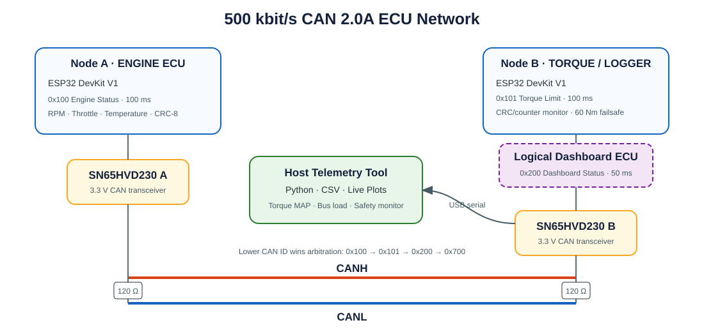

# CAN Bus ECU Simulator and Data Logger



A portfolio-ready automotive CAN 2.0A network built with two low-cost ESP32 development boards and two 3.3 V CAN transceivers. The project demonstrates embedded firmware, message and signal design, safety-oriented communication monitoring, data logging, protocol decoding, automated validation, and real-time visualization.

The network operates at **500 kbit/s** with standard 11-bit identifiers:

- **Node A — Engine ECU:** simulates a repeatable drive cycle and broadcasts RPM, throttle position, coolant temperature, a rolling counter, and CRC every 100 ms.
- **Node B — Torque/Logger ECU:** validates Engine Status frames, calculates torque limits, applies a deterministic fail-safe policy, publishes dashboard data, and bridges relevant bus traffic to the host over USB serial. Optional microSD logging is included.
- **Host Telemetry ECU:** decodes traffic from a custom DBC-style database, records CSV data, estimates bus utilization, mirrors the safety-state logic, and plots time-series signals and a live RPM–torque map.

The dashboard is implemented as a third **logical ECU** on Node B, so the baseline system requires only two boards. Its 50 ms message creates a useful mix of CAN priorities and transmission periods. The same logic can later be moved to a third physical ESP32 without changing the protocol.

## Engineering highlights

- Classical CAN 2.0A, 11-bit identifiers, 500 kbit/s
- ESP32 native TWAI controller with external SN65HVD230 transceivers
- Explicit Intel/little-endian signal encoding
- CRC-8/SAE-J1850 protection for application messages
- Four-bit rolling counters and sequence-loss detection
- Fail-safe torque limited to 60 Nm after three consecutive faults or a 300 ms timeout
- Three consecutive valid frames required to leave fail-safe mode
- Multi-rate traffic at 50 ms, 100 ms, and 1000 ms
- CAN priority demonstration using IDs 0x100, 0x101, 0x200, 0x701, and 0x702
- Built-in bad-CRC, wrong-DLC, and timeout fault injection
- Bus-off recovery polling and truthful TX logging only after successful CAN transmission
- CSV logging of raw frames, decoded signals, CRC status, bus load, and safety state
- Live RPM, throttle, torque-limit, and RPM–torque-map visualization
- Hardware-free traffic simulation and 12 automated host-side tests

## Repository layout

```text
config/vehicle.dbc.json          Custom DBC-style bus and signal database
firmware/platformio.ini          PlatformIO environments for both ESP32 nodes
firmware/src/common/             Shared CAN driver and protocol utilities
firmware/src/engine_ecu/         Engine ECU firmware and fault injection
firmware/src/torque_logger_ecu/  Torque, safety, gateway, dashboard, and SD logic
host/can_ecu_tool/               Python decoder, logger, simulator, and plots
host/tests/                      Protocol, safety, and bus-load tests
docs/network_topology.svg        Network architecture diagram
docs/WIRING.md                   Wiring and power-up instructions
docs/PROTOCOL.md                 Message layout, CRC, arbitration, and safety design
docs/TEST_AND_ACCEPTANCE.md       Validation procedure and measurable criteria
```

## Hardware bill of materials

| Qty. | Component | Recommended specification | Purpose |
|---:|---|---|---|
| 2 | ESP32 development board | 30-pin ESP32 DevKit V1 / ESP32-WROOM-32 | Engine and Torque/Logger nodes |
| 2 | CAN transceiver module | SN65HVD230, 3.3 V, assembled headers | ISO 11898-2 physical layer |
| 2 | Termination resistor | 120 Ω, 1/4 W | One at each physical end of the bus |
| 2 | USB data cable | Match the selected board connector | Flashing, power, and serial logging |
| 2 | Breadboard | 400 or 830 tie points | Prototyping |
| 1 set | Jumper wires | Male–male, male–female, and female–female | Interconnection |
| 1 | Twisted pair | 0.5–1 m for the bench setup | CANH and CANL |
| 1 | Digital multimeter | Resistance and DC voltage modes | Termination and short-circuit checks |

Optional: a 3.3 V-compatible SPI microSD module and FAT32 microSD card.

> ESP32 includes a CAN/TWAI controller but not a physical-layer transceiver. Each board must use an external SN65HVD230. Do not connect ESP32 GPIO directly to CANH/CANL, and never power the transceiver module from 5 V unless its exact module documentation explicitly supports it.

## Run without hardware

Requirements: Python 3.10 or newer.

```powershell
cd host
python -m venv .venv
.venv\Scripts\python.exe -m pip install -e .
.venv\Scripts\can-ecu.exe --dbc ..\config\vehicle.dbc.json --simulate --plot --duration 30 --output simulation.csv
.venv\Scripts\python.exe -m unittest discover -s tests -v
```

Expected result:

- Four live panels: RPM, throttle, torque limit, and RPM–torque map
- IDs 0x100, 0x101, 0x200, 0x701, and 0x702 in `simulation.csv`
- `bad_crc=0`
- Steady-state worst-case bus-load estimate near 1.118%
- `safe=False` after the initial three-frame recovery sequence
- All 12 automated tests pass

## Build and flash the ESP32 nodes

Install Visual Studio Code and the PlatformIO IDE extension, then open the `firmware` directory. The available PlatformIO environments are:

- `engine_ecu`
- `torque_logger_ecu`
- `torque_logger_ecu_sd` (optional SD-enabled build)

Command-line equivalent:

```powershell
cd firmware
pio run -e engine_ecu
pio run -e engine_ecu -t upload --upload-port COM_A
pio run -e torque_logger_ecu
pio run -e torque_logger_ecu -t upload --upload-port COM_B
```

Replace `COM_A` and `COM_B` with the ports shown in Windows Device Manager. If uploading remains at `Connecting...`, hold the board's BOOT button and release it when writing begins.

Wire the boards according to [WIRING.md](docs/WIRING.md). Make all changes with power disconnected and verify approximately 60 Ω between CANH and CANL before applying power.

## Capture a physical bus session

Connect the host tool to Node B's USB serial port:

```powershell
cd host
.venv\Scripts\can-ecu.exe --dbc ..\config\vehicle.dbc.json --port COM_B --plot --duration 60 --output hardware_60s.csv
```

Close PlatformIO Serial Monitor before running the command because only one application can own a serial port. The gateway format is:

```text
@CAN,1234,100,8,204E64015A0000A7
```

Fields are gateway time in milliseconds, hexadecimal CAN ID, DLC, and payload bytes.

## Built-in fault injection

Keep the logger connected to Node B and open a separate 115200-baud serial terminal for Node A. Send one of these commands:

| Command | Injected condition | Expected ECU response |
|---|---|---|
| `BADCRC3` | Corrupt the next three Engine Status CRC bytes | Enter fail-safe and command 60 Nm |
| `BADDLC3` | Send the next three Engine Status frames with DLC 7 | Reject frames and enter fail-safe |
| `PAUSE1000` | Stop Engine Status for one second | Detect 300 ms timeout and enter fail-safe |
| `NORMAL` | Clear pending injection | Resume normal generation; recover after valid sequence |

See [TEST_AND_ACCEPTANCE.md](docs/TEST_AND_ACCEPTANCE.md) for the full validation matrix.

## Optional microSD logging

Connect the SPI module as documented and build/flash the `torque_logger_ecu_sd` environment. The firmware appends raw traffic to `/canlog.csv`. USB logging remains available.

## Bus-load budget

The static schedule produces a conservative worst-case estimate of **1.118%** at 500 kbit/s, including maximum classical CAN bit stuffing and inter-frame spacing. The acceptance limit is **1.5%**. This leaves substantial bandwidth for future signals while keeping timing behavior easy to inspect on a student bench setup.

## Verification status

Completed in software:

- All three PlatformIO environments compile successfully with pinned `espressif32@7.1.2` for the `esp32dev` target
- Engine firmware: 275,157 bytes Flash (21.0%) and 21,528 bytes RAM (6.6%) in the verified build
- Torque/Logger firmware: 276,721 bytes Flash (21.1%) and 21,560 bytes RAM (6.6%) in the verified build
- The optional SD-enabled code path is compile-verified at 337,489 bytes Flash (25.7%) and 22,152 bytes RAM (6.8%); physical card writing remains hardware-dependent
- DBC-style configuration validation
- CRC-8/SAE-J1850 standard check vector
- Parser, signal-scaling, wrong-DLC, bad-CRC, counter-loss, timeout, recovery, and load tests
- Hardware-free simulation covering all five CAN IDs
- Live plot path exercised with a non-interactive test backend
- 12 automated tests passing

Still requires physical completion:

- Flashing and running the compiled firmware on the selected ESP32 boards
- Wiring, termination, and power checks
- Two-node communication and 10-minute stability test
- Physical bad-CRC, wrong-DLC, and timeout fault injection
- Optional oscilloscope or CAN-analyzer measurements

## Current limitations

- Firmware compilation is verified, but flashing, transceiver behavior, termination, physical timing, and long-duration operation cannot be proven without the two physical boards.
- The database is intentionally DBC-style JSON, not a production Vector `.dbc` file.
- The Dashboard ECU is a logical function sharing Node B's controller, not an independent third physical node.
- Bus utilization is a conservative calculation from observed gateway frames, not a direct measurement from a CAN analyzer.
- The 60 Nm fail-safe policy is an educational design choice, not a value derived from a real vehicle safety analysis or ISO 26262 process.
- The SD-enabled firmware compiles, but card compatibility, write latency, power-loss behavior, and filesystem durability require physical testing.
- Bus-off recovery is implemented and compile-verified, but its recovery timing still requires cable-disconnect testing on the real network.

## Portfolio summary

> Designed and implemented a two-node 500 kbit/s CAN 2.0A ECU network on ESP32, including CRC-8/SAE-J1850 protection, rolling-counter and timeout-based fail-safe torque control, multi-rate arbitration, serial/SD logging, custom DBC-style decoding, bus-load monitoring, automated fault validation, and live torque-map visualization.

This project is intended for bench education and portfolio demonstration. It must not be connected directly to a production vehicle or used in a safety-critical system.

## License

MIT
